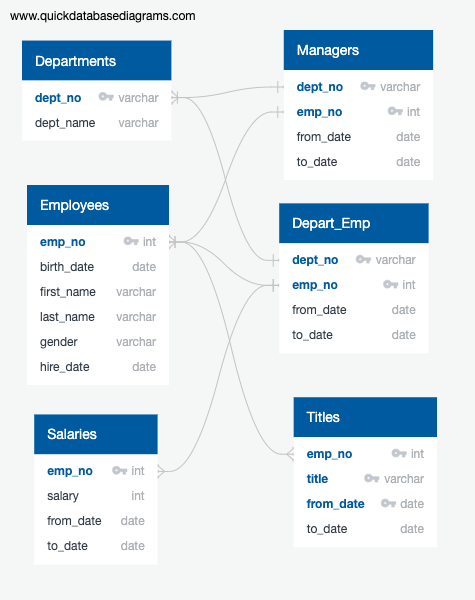
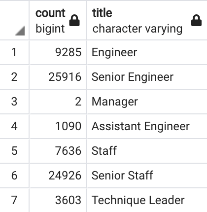

# Pewlett-Hackard-Analysis
## Project Overview
### Using PostgreSQL to 
- Design an ERD that will apply to the data.
- Create and use a SQL database.
- Import and export large CSV datasets into pgAdmin.
- Practice using different joins to create new tables in pgAdmin.
- Write basic- to intermediate-level SQL statements.

#### The following SQL analysis of employee data was used to:
- Determine the number of retiring employees per title, and identify employees who are eligible to participate in a mentorship program.

### Resources
- Data Source: (1) departments.csv, (2) dept_emp.csv, (3) dept_manager.csv, (4) employees.csv, (5) salaries.csv, and (6) titles.csv
- Relational database system: PostgreSQL 13.5
- Software: pgAdmin 4

## Results
- There is a bulleted list with four major points from the two analysis deliverables. (6 pt)
   
   

## Summary
-  The summary addresses the two questions and contains two additional queries or tables that may provide more insight. (5 pt)
